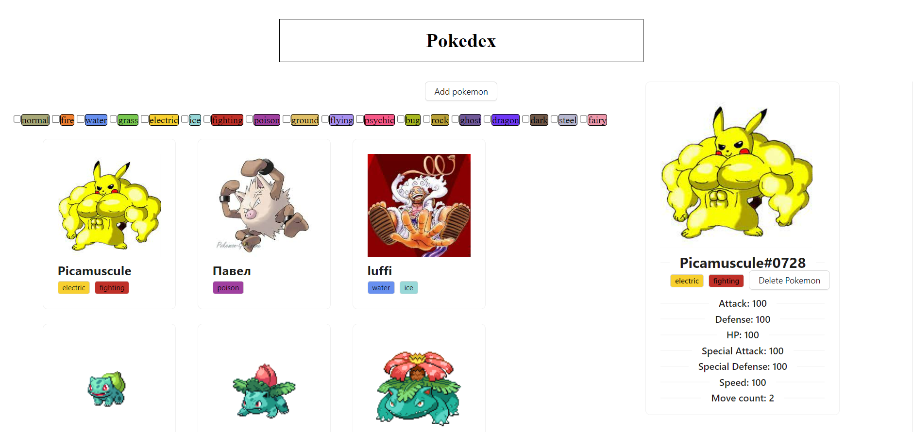

#Implementation of a Pokedex.

Pokémon were taken from a public resource https://pokeapi.co/
. It is possible to filter PokemonTypes by type, and when you click on a PokemonTypes, you can view more detailed stats.


## Старт

> Для работы с проектом потребуется [Node.js](https://nodejs.org/en/) версии 14.x.x или выше.

1. Склонировать репозиторий 
```shell
git clone https://github.com/pavelpurga/Pokedex.git
```
2. Установить модули
```shell
npm i
```
3. Запустить проект
```shell
npm start
```

После запуска проект будет доступен на [http://localhost:3000](http://localhost:3000). Внесённые правки будут сразу же отображаться в браузере

